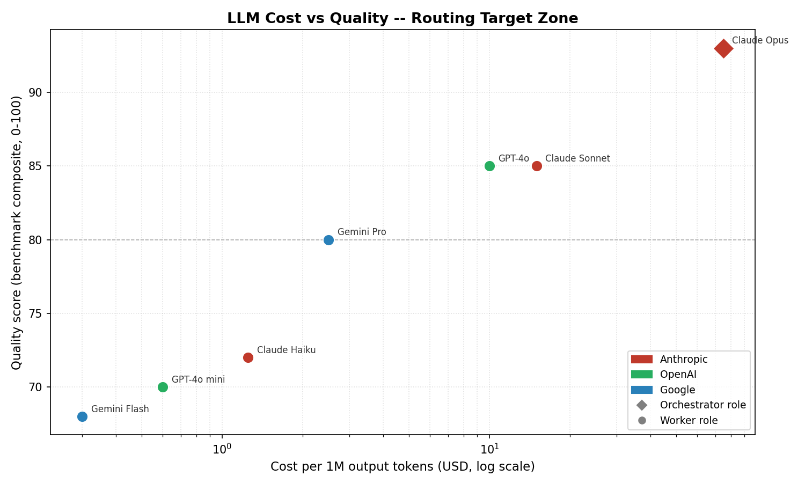
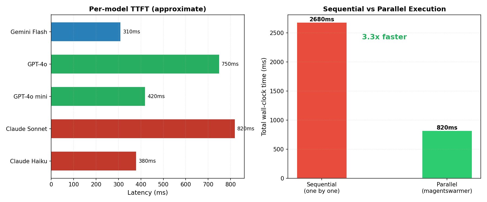

# magentswarmer

**Spawn and coordinate AI agents across Claude, GPT, and Gemini -- in parallel, on a VPS, from your laptop.**

[](https://www.python.org/)
[](LICENSE)
[]()

```
                        ┌─────────────────────────────┐
                        │   ORCHESTRATOR (Opus-class)  │
                        │   plans, routes, synthesizes │
                        └──────────────┬──────────────┘
                                       │
               ┌───────────────────────┼───────────────────────┐
               │                       │                       │
   ┌───────────▼──────────┐ ┌──────────▼─────────┐ ┌──────────▼─────────┐
   │  Claude Sonnet/Haiku │ │   GPT-4o / 4o-mini │ │  Gemini Flash/Pro  │
   │  fast structured work│ │  code and analysis  │ │  long context, web │
   └──────────────────────┘ └────────────────────┘ └────────────────────┘
               │                       │                       │
               └───────────────────────┼───────────────────────┘
                                       │
                        ┌──────────────▼──────────────┐
                        │      SYNTHESIZED OUTPUT      │
                        └─────────────────────────────┘
```

---

## Why this exists

Running one expensive model for every task is wasteful. Running only cheap models hurts quality on hard problems. The right architecture is a capable orchestrator that plans and synthesizes, paired with specialized workers routed by task type and cost target.

A single Opus call costs ~60x more than Haiku. For most subtasks -- web lookups, code generation, structured extraction -- Haiku or GPT-4o-mini is plenty. The orchestrator earns its cost by decomposing the problem correctly and combining results well.

This is not theoretical. The research backs it:

- **Mixture-of-Agents** (Wang et al., 2024, arXiv:2406.04692): Layered architectures combining multiple LLMs outperform any single model, including GPT-4 Omni, using only open-source models. Aggregation across agents consistently improves output quality.
- **AutoGen** (Wu et al., 2023, arXiv:2308.08155): Multi-agent conversation frameworks built on LLMs outperform single-agent baselines across math, coding, and decision-making benchmarks. Decomposition and handoff between agents is a core architectural pattern.
- **Hybrid LLM** (Ding et al., 2024, ICLR 2024, arXiv:2404.14618): Dynamic routing between small and large models based on query difficulty achieves up to 40% fewer expensive model calls with no quality loss. Routing is better than always choosing the top model.

magentswarmer implements these ideas in a minimal, deployable Python package.

---

## Install

```bash
git clone https://github.com/yourusername/magentswarmer.git
cd magentswarmer
python3.11 -m venv .venv && source .venv/bin/activate
pip install -r requirements.txt
cp .env.example .env
# edit .env with your API keys
```

---

## Quickstart

```python
import asyncio
from src.orchestrator import Orchestrator

async def main():
    orch = Orchestrator()
    result = await orch.run(
        "Compare the trade-offs between RAG and fine-tuning for domain-specific LLM applications."
    )
    print(result)

asyncio.run(main())
```

The orchestrator decomposes the goal, routes subtasks to the right models, runs them in parallel, and returns a synthesized answer.

Or run the included demos directly:

```bash
# Three providers answer the same research question simultaneously
python demos/demo_research.py

# Benchmark five models on the same prompt, compare latency and output
python demos/demo_compare.py
```

---

## Architecture

### Orchestrator (always Opus-class)

The orchestrator runs on the most capable model available. It:

1. Receives the user goal
2. Decomposes it into independent subtasks (JSON output)
3. Routes each task to the right provider and model via the router
4. Runs all tasks concurrently via the swarm
5. Synthesizes results into a final answer

The orchestrator is the only component that sees the full picture. Workers are stateless and focused.

### Router

Maps (task type, cost profile) to (provider, model). Task types: `orchestration`, `code`, `research`, `analysis`, `quick`, `creative`. Cost profiles: `cheapest`, `balanced`, `best`.

```
TaskType.CODE    + CostProfile.BALANCED  -> OpenAI  / gpt-4o
TaskType.QUICK   + CostProfile.CHEAPEST  -> Claude  / Haiku
TaskType.RESEARCH + CostProfile.BEST     -> Gemini  / gemini-2.5-pro
```

### Workers

Three provider adapters share a common `BaseWorker` interface: `ClaudeWorker`, `OpenAIWorker`, `GeminiWorker`. Each handles auth, API calls, and error handling independently. All are `async` and can run concurrently.

### Swarm

`Swarm` takes a list of `WorkerTask` objects, respects a concurrency limit, runs all tasks with `asyncio.gather`, and streams results via an optional callback.

---

## Model selection rationale

| Model | Cost per 1M out | Best use | Recommended role |
|---|---|---|---|
| Claude Opus | ~$75 | Complex reasoning, orchestration | Orchestrator |
| Claude Sonnet | ~$15 | Structured analysis, writing | Worker (balanced) |
| Claude Haiku | ~$1.25 | Fast lookup, classification | Worker (cheap) |
| GPT-4o | ~$10 | Code, structured output | Worker (balanced) |
| GPT-4o mini | ~$0.60 | Short tasks, extraction | Worker (cheap) |
| Gemini Flash | ~$0.30 | Speed-critical tasks | Worker (cheap) |
| Gemini Pro | ~$2.50 | Long context, web grounding | Worker (research) |

*Pricing approximate as of May 2026. Verify against provider pricing pages.*

Key insight: the performance gap between Opus and Sonnet on most subtasks is small. The gap between Opus and Haiku on orchestration is large. Route accordingly.




*(Generate charts yourself: `python charts/model_cost_quality.py && python charts/latency_comparison.py`)*

---

## Comparison to alternatives

| | magentswarmer | LangChain Agents | AutoGen | CrewAI | LlamaIndex |
|---|---|---|---|---|---|
| Multi-provider routing | Yes | Partial | Limited | Limited | Limited |
| Async parallel workers | Yes | Partial | Yes | No | Partial |
| VPS deploy + systemd | Yes | No | No | No | No |
| Remote control via SSH | Yes | No | No | No | No |
| Dependencies | Minimal | Heavy | Moderate | Moderate | Heavy |
| Lines of core code | ~400 | 50,000+ | 15,000+ | 5,000+ | 30,000+ |
| Model selection router | Built-in | Manual | Manual | Manual | Manual |

LangChain, AutoGen, and CrewAI are excellent for complex pipelines and have large ecosystems. magentswarmer is for teams that want a thin, auditable layer they fully understand, that runs on a cheap VPS without a web server, and that can route across Claude, OpenAI, and Gemini without framework lock-in.

---

## VPS deployment

Tested on Ubuntu 22.04 / 24.04 (Hetzner CX22, ~$5/month is sufficient for most workloads).

```bash
# On your VPS as root
curl -fsSL https://raw.githubusercontent.com/yourusername/magentswarmer/main/deploy/vps_setup.sh | bash
```

Or manually:

```bash
git clone https://github.com/yourusername/magentswarmer.git /opt/magentswarmer
cd /opt/magentswarmer && python3.11 -m venv .venv && source .venv/bin/activate
pip install -r requirements.txt
cp .env.example .env && nano .env  # add API keys
cp deploy/systemd_service.example /etc/systemd/system/magentswarmer.service
systemctl enable --now magentswarmer
journalctl -u magentswarmer -f
```

---

## Remote control

Control the swarm from your laptop without installing anything locally.

```bash
# SSH into your VPS
ssh user@your-vps-ip

# Set a new goal and restart
echo 'SWARM_GOAL=Analyze the latest research on retrieval-augmented generation' >> /opt/magentswarmer/.env
systemctl restart magentswarmer
journalctl -u magentswarmer -f
```

For interactive control from a development machine, use the orchestrator directly over SSH port forwarding or a simple REST wrapper (not included, intentionally kept out of scope here).

---

## Roadmap

- [ ] REST API for goal submission and result polling
- [ ] Web dashboard for swarm status and result history
- [ ] Memory layer for multi-turn orchestration
- [ ] Streaming output as workers complete
- [ ] Provider fallback on rate limits

---

## Contributing

Issues and pull requests welcome. Keep PRs focused: one change per PR. Run existing demos before submitting.

## License

MIT. See [LICENSE](LICENSE).
